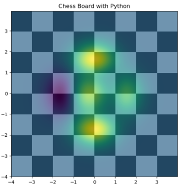

# Python-Chessboard-Generator
Created a chessboard in Python using NumPy and Matplotlib. This project generates an 8x8 chessboard with alternating colors and overlays a visualization pattern. Useful for Python graphics practice, beginners learning visualization, and reusable for similar board-based visual tasks.

This project generates a chessboard using Python. A chessboard is a square board with alternating black and white squares used in the game of chess. Here, we use Python libraries to visualize it.

## 🧠 What this project does
- Uses NumPy to generate board logic
- Uses Matplotlib to visualize it
- Displays a graphical chessboard

## 🚀 How to Run
1. Install dependencies
2. Run the program

## 📷 Output

## 🛠 Libraries Used
- Matplotlib
- NumPy
